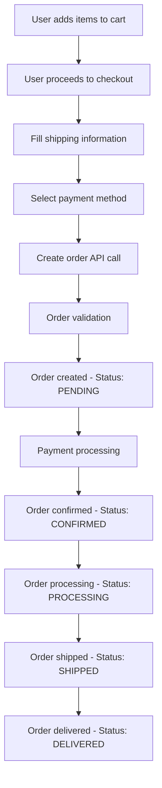

# Order System API Documentation

**Version:** 1.0  
**Base URL:** `http://localhost:5000/api/v1`  
**Authentication:** Bearer Token (JWT)

---

## Table of Contents

1. [Overview](#overview)
2. [Authentication](#authentication)
3. [Order Flow](#order-flow)
4. [API Endpoints](#api-endpoints)
5. [Data Models](#data-models)
6. [Error Handling](#error-handling)
7. [Frontend Integration Examples](#frontend-integration-examples)
8. [Testing Guide](#testing-guide)

---

## Overview

The Order System handles the complete e-commerce order lifecycle for MalricPharma, from order creation to delivery tracking. It provides secure, authenticated endpoints for customers to place orders and track their order history.

### Key Features

- ✅ Secure order creation with authentication
- ✅ Order history and tracking
- ✅ Admin order management
- ✅ Order status updates
- ✅ Product validation and pricing verification
- ✅ Comprehensive error handling

---

## Authentication

All order endpoints require JWT authentication. Include the token in the Authorization header:

```http
Authorization: Bearer <your-jwt-token>
```

### Getting Authentication Token

1. **Register User:**

   ```http
   POST /api/v1/auth/register
   Content-Type: application/json

   {
     "name": "John Doe",
     "email": "john@example.com",
     "password": "password123"
   }
   ```

2. **Login User:**

   ```http
   POST /api/v1/auth/login
   Content-Type: application/json

   {
     "email": "john@example.com",
     "password": "password123"
   }
   ```

   **Response:**

   ```json
   {
     "success": true,
     "data": {
       "token": "eyJhbGciOiJIUzI1NiIsInR5cCI6IkpXVCJ9...",
       "user": {
         "id": 1,
         "name": "John Doe",
         "email": "john@example.com",
         "is_admin": false
       }
     }
   }
   ```

---

## Order Flow



---

## API Endpoints

### 1. Create Order

**Endpoint:** `POST /api/v1/orders`  
**Authentication:** Required  
**Description:** Creates a new order for the authenticated user

**Request Headers:**

```http
Authorization: Bearer <token>
Content-Type: application/json
```

**Request Body:**

```json
{
  "items": [
    {
      "productId": 1,
      "quantity": 2,
      "price": 8.99
    },
    {
      "productId": 5,
      "quantity": 1,
      "price": 15.99
    }
  ],
  "shipping": {
    "fullName": "John Doe",
    "address": "123 Main Street, Apt 4B",
    "city": "Nairobi",
    "postalCode": "00100",
    "phone": "+254700000000",
    "email": "john@example.com",
    "notes": "Please call before delivery"
  },
  "payment": {
    "method": "mpesa",
    "phone": "+254700000000"
  }
}
```

**Success Response (201):**

```json
{
  "success": true,
  "data": {
    "order": {
      "id": "cm123456789",
      "orderNumber": "MP1703932800000",
      "status": "PENDING",
      "total": 33.97,
      "createdAt": "2024-12-30T10:00:00.000Z",
      "estimatedDelivery": "2024-01-01T10:00:00.000Z",
      "items": [
        {
          "id": "item_123",
          "productId": 1,
          "productName": "Paracetamol 500mg",
          "quantity": 2,
          "price": 8.99,
          "subtotal": 17.98
        },
        {
          "id": "item_124",
          "productId": 5,
          "productName": "Vitamin D3 1000IU",
          "quantity": 1,
          "price": 15.99,
          "subtotal": 15.99
        }
      ],
      "shipping": {
        "fullName": "John Doe",
        "address": "123 Main Street, Apt 4B",
        "city": "Nairobi",
        "postalCode": "00100",
        "phone": "+254700000000",
        "email": "john@example.com",
        "notes": "Please call before delivery"
      },
      "payment": {
        "method": "mpesa",
        "phone": "+254700000000"
      }
    }
  },
  "message": "Order created successfully"
}
```

### 2. Get User Orders

**Endpoint:** `GET /api/v1/orders`  
**Authentication:** Required  
**Description:** Retrieves all orders for the authenticated user

**Query Parameters:**

- `page` (optional): Page number for pagination (default: 1)
- `limit` (optional): Items per page (default: 10, max: 100)
- `status` (optional): Filter by order status

**Request:**

```http
GET /api/v1/orders?page=1&limit=10&status=CONFIRMED
Authorization: Bearer <token>
```

**Success Response (200):**

```json
{
  "success": true,
  "data": {
    "orders": [
      {
        "id": "cm123456789",
        "orderNumber": "MP1703932800000",
        "status": "CONFIRMED",
        "total": 33.97,
        "itemCount": 2,
        "createdAt": "2024-12-30T10:00:00.000Z",
        "estimatedDelivery": "2024-01-01T10:00:00.000Z"
      }
    ],
    "pagination": {
      "page": 1,
      "limit": 10,
      "total": 1,
      "totalPages": 1
    }
  }
}
```

### 3. Get Specific Order

**Endpoint:** `GET /api/v1/orders/:id`  
**Authentication:** Required  
**Description:** Retrieves detailed information about a specific order

**Request:**

```http
GET /api/v1/orders/cm123456789
Authorization: Bearer <token>
```

**Success Response (200):**

```json
{
  "success": true,
  "data": {
    "order": {
      "id": "cm123456789",
      "orderNumber": "MP1703932800000",
      "status": "PROCESSING",
      "total": 33.97,
      "createdAt": "2024-12-30T10:00:00.000Z",
      "updatedAt": "2024-12-30T12:00:00.000Z",
      "estimatedDelivery": "2024-01-01T10:00:00.000Z",
      "items": [
        {
          "id": "item_123",
          "productId": 1,
          "productName": "Paracetamol 500mg",
          "productDescription": "Effective pain relief and fever reducer",
          "quantity": 2,
          "price": 8.99,
          "subtotal": 17.98,
          "imageUrl": "https://example.com/image.jpg"
        }
      ],
      "shipping": {
        "fullName": "John Doe",
        "address": "123 Main Street, Apt 4B",
        "city": "Nairobi",
        "postalCode": "00100",
        "phone": "+254700000000",
        "email": "john@example.com",
        "notes": "Please call before delivery"
      },
      "payment": {
        "method": "mpesa",
        "phone": "+254700000000",
        "status": "completed"
      },
      "statusHistory": [
        {
          "status": "PENDING",
          "timestamp": "2024-12-30T10:00:00.000Z"
        },
        {
          "status": "CONFIRMED",
          "timestamp": "2024-12-30T10:05:00.000Z"
        },
        {
          "status": "PROCESSING",
          "timestamp": "2024-12-30T12:00:00.000Z"
        }
      ]
    }
  }
}
```

### 4. Cancel Order

**Endpoint:** `DELETE /api/v1/orders/:id`  
**Authentication:** Required  
**Description:** Cancels a pending order

**Request:**

```http
DELETE /api/v1/orders/cm123456789
Authorization: Bearer <token>
```

**Success Response (200):**

```json
{
  "success": true,
  "data": {
    "order": {
      "id": "cm123456789",
      "orderNumber": "MP1703932800000",
      "status": "CANCELLED"
    }
  },
  "message": "Order cancelled successfully"
}
```

### 5. Admin: Get All Orders

**Endpoint:** `GET /api/v1/orders/admin/all`  
**Authentication:** Required (Admin only)  
**Description:** Retrieves all orders for admin users

**Query Parameters:**

- `page` (optional): Page number for pagination
- `limit` (optional): Items per page
- `status` (optional): Filter by order status
- `userId` (optional): Filter by specific user

**Request:**

```http
GET /api/v1/orders/admin/all?status=PENDING&page=1&limit=20
Authorization: Bearer <admin-token>
```

### 6. Admin: Update Order Status

**Endpoint:** `PATCH /api/v1/orders/:id/status`  
**Authentication:** Required (Admin only)  
**Description:** Updates the status of an order

**Request:**

```http
PATCH /api/v1/orders/cm123456789/status
Authorization: Bearer <admin-token>
Content-Type: application/json

{
  "status": "SHIPPED",
  "notes": "Shipped via DHL. Tracking: DHL123456789"
}
```

**Success Response (200):**

```json
{
  "success": true,
  "data": {
    "order": {
      "id": "cm123456789",
      "orderNumber": "MP1703932800000",
      "status": "SHIPPED",
      "updatedAt": "2024-12-30T14:00:00.000Z"
    }
  },
  "message": "Order status updated successfully"
}
```

---

## Data Models

### Order Status Enum

```typescript
type OrderStatus =
  | "PENDING" // Order created, awaiting payment
  | "CONFIRMED" // Payment successful
  | "PROCESSING" // Order being prepared
  | "SHIPPED" // Order dispatched
  | "DELIVERED" // Order delivered
  | "CANCELLED"; // Order cancelled
```

### Payment Methods

```typescript
type PaymentMethod =
  | "mpesa" // M-Pesa mobile money
  | "card" // Credit/Debit card
  | "cod"; // Cash on delivery
```

### Order Item Interface

```typescript
interface OrderItem {
  productId: number;
  quantity: number;
  price: number;
}
```

### Shipping Information Interface

```typescript
interface ShippingInfo {
  fullName: string;
  address: string;
  city: string;
  postalCode: string;
  phone: string;
  email?: string;
  notes?: string;
}
```

### Payment Information Interface

```typescript
interface PaymentInfo {
  method: PaymentMethod;
  phone?: string; // Required for M-Pesa
  cardToken?: string; // Required for card payments
}
```

---

## Error Handling

### Error Response Format

```json
{
  "success": false,
  "error": {
    "code": "ERROR_CODE",
    "message": "Human readable error message",
    "details": "Additional error details (optional)"
  }
}
```

### Common Error Codes

| HTTP Status | Error Code          | Description                                   |
| ----------- | ------------------- | --------------------------------------------- |
| 400         | `INVALID_ITEMS`     | Order items are missing or invalid            |
| 400         | `INVALID_SHIPPING`  | Shipping information is incomplete            |
| 400         | `INVALID_PAYMENT`   | Payment information is invalid                |
| 400         | `PRODUCT_NOT_FOUND` | One or more products don't exist              |
| 400         | `PRICE_MISMATCH`    | Product prices don't match current prices     |
| 401         | `UNAUTHORIZED`      | Authentication token missing or invalid       |
| 403         | `FORBIDDEN`         | User doesn't have permission for this action  |
| 404         | `ORDER_NOT_FOUND`   | Order doesn't exist or doesn't belong to user |
| 400         | `CANNOT_CANCEL`     | Order cannot be cancelled in current status   |
| 500         | `INTERNAL_ERROR`    | Server error occurred                         |

### Error Examples

**Invalid Items Error:**

```json
{
  "success": false,
  "error": {
    "code": "INVALID_ITEMS",
    "message": "Order must contain at least one item"
  }
}
```

**Price Mismatch Error:**

```json
{
  "success": false,
  "error": {
    "code": "PRICE_MISMATCH",
    "message": "Product prices have changed",
    "details": {
      "productId": 1,
      "submittedPrice": 8.99,
      "currentPrice": 9.99
    }
  }
}
```

---

## Frontend Integration Examples

### React/JavaScript Integration

#### 1. Create Order Function

```javascript
const createOrder = async (orderData, token) => {
  try {
    const response = await fetch("/api/v1/orders", {
      method: "POST",
      headers: {
        "Content-Type": "application/json",
        Authorization: `Bearer ${token}`,
      },
      body: JSON.stringify(orderData),
    });

    const result = await response.json();

    if (!result.success) {
      throw new Error(result.error.message);
    }

    return result.data.order;
  } catch (error) {
    console.error("Error creating order:", error);
    throw error;
  }
};

// Usage
const orderData = {
  items: cartItems.map((item) => ({
    productId: item.id,
    quantity: item.quantity,
    price: item.price,
  })),
  shipping: shippingForm,
  payment: paymentForm,
};

const order = await createOrder(orderData, authToken);
console.log("Order created:", order.orderNumber);
```

#### 2. Get User Orders

```javascript
const getUserOrders = async (token, page = 1, status = null) => {
  try {
    let url = `/api/v1/orders?page=${page}&limit=10`;
    if (status) url += `&status=${status}`;

    const response = await fetch(url, {
      headers: {
        Authorization: `Bearer ${token}`,
      },
    });

    const result = await response.json();

    if (!result.success) {
      throw new Error(result.error.message);
    }

    return result.data;
  } catch (error) {
    console.error("Error fetching orders:", error);
    throw error;
  }
};
```

#### 3. Order Status Component

```jsx
import React, { useState, useEffect } from "react";

const OrderStatus = ({ orderId, token }) => {
  const [order, setOrder] = useState(null);
  const [loading, setLoading] = useState(true);

  useEffect(() => {
    const fetchOrder = async () => {
      try {
        const response = await fetch(`/api/v1/orders/${orderId}`, {
          headers: {
            Authorization: `Bearer ${token}`,
          },
        });

        const result = await response.json();
        if (result.success) {
          setOrder(result.data.order);
        }
      } catch (error) {
        console.error("Error fetching order:", error);
      } finally {
        setLoading(false);
      }
    };

    fetchOrder();
  }, [orderId, token]);

  if (loading) return <div>Loading...</div>;
  if (!order) return <div>Order not found</div>;

  return (
    <div className="order-status">
      <h3>Order #{order.orderNumber}</h3>
      <div className="status-badge status-{order.status.toLowerCase()}">
        {order.status}
      </div>
      <p>Total: ${order.total}</p>
      <p>
        Estimated Delivery:{" "}
        {new Date(order.estimatedDelivery).toLocaleDateString()}
      </p>

      <div className="order-items">
        <h4>Items:</h4>
        {order.items.map((item) => (
          <div key={item.id} className="order-item">
            <span>{item.productName}</span>
            <span>Qty: {item.quantity}</span>
            <span>${item.subtotal}</span>
          </div>
        ))}
      </div>
    </div>
  );
};
```

### Form Validation Helper

```javascript
const validateOrderData = (orderData) => {
  const errors = {};

  // Validate items
  if (!orderData.items || orderData.items.length === 0) {
    errors.items = "At least one item is required";
  }

  // Validate shipping
  const shipping = orderData.shipping;
  if (!shipping.fullName) errors.fullName = "Full name is required";
  if (!shipping.address) errors.address = "Address is required";
  if (!shipping.city) errors.city = "City is required";
  if (!shipping.phone) errors.phone = "Phone number is required";

  // Validate payment
  const payment = orderData.payment;
  if (!payment.method) errors.paymentMethod = "Payment method is required";
  if (payment.method === "mpesa" && !payment.phone) {
    errors.mpesaPhone = "M-Pesa phone number is required";
  }

  return {
    isValid: Object.keys(errors).length === 0,
    errors,
  };
};
```

---

## Testing Guide

### Prerequisites

1. Server running on `http://localhost:5000`
2. Valid JWT token from authentication
3. Products seeded in database

### Testing with Postman

1. **Import Collection:**
   Create a Postman collection with the following requests:

2. **Set Environment Variables:**

   - `baseUrl`: `http://localhost:5000/api/v1`
   - `authToken`: Your JWT token

3. **Test Sequence:**
   1. Register/Login to get token
   2. Create order
   3. Get user orders
   4. Get specific order
   5. Cancel order (if needed)

### Testing with cURL

```bash
# 1. Register user
curl -X POST http://localhost:5000/api/v1/auth/register \
  -H "Content-Type: application/json" \
  -d '{"name":"Test User","email":"test@example.com","password":"password123"}'

# 2. Login
curl -X POST http://localhost:5000/api/v1/auth/login \
  -H "Content-Type: application/json" \
  -d '{"email":"test@example.com","password":"password123"}'

# 3. Create order (replace TOKEN with actual token)
curl -X POST http://localhost:5000/api/v1/orders \
  -H "Content-Type: application/json" \
  -H "Authorization: Bearer TOKEN" \
  -d '{
    "items": [{"productId": 1, "quantity": 2, "price": 8.99}],
    "shipping": {
      "fullName": "Test User",
      "address": "123 Test St",
      "city": "Nairobi",
      "postalCode": "00100",
      "phone": "+254700000000"
    },
    "payment": {"method": "mpesa", "phone": "+254700000000"}
  }'

# 4. Get orders
curl -X GET http://localhost:5000/api/v1/orders \
  -H "Authorization: Bearer TOKEN"
```

---

## Support

For technical support or questions about the API:

- **Backend Developer:** [Your Contact]
- **API Documentation:** This document
- **Postman Collection:** [Link to collection if available]

---

**Last Updated:** December 30, 2024  
**API Version:** 1.0
